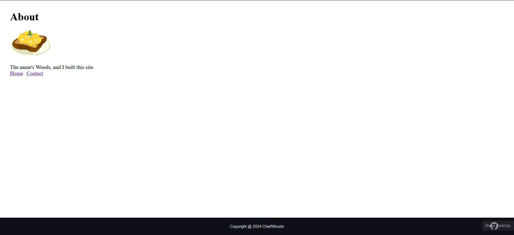

# Basic Informational Site



Informational site for [The Odin Project](https://www.theodinproject.com/).

[Live Website](https://basic-informational-site-4c8o.onrender.com)

[Source Repository](https://github.com/ChiefWoods/basic-informational-site)

## Built With

### Languages

- [](https://html5.org/)
- [](https://www.w3.org/Style/CSS/Overview.en.html)
- [](https://js.org/index.html)

### Packages

- [](https://expressjs.com/)

### Runtime

- [](https://bun.sh/)

## Getting Started

### Prerequisites

Update your Bun toolkit to the latest version.

```bash
bun upgrade
```

### Setup

1. Clone the repository

```bash
git clone https://github.com/ChiefWoods/basic-informational-site.git
```

2. Install all dependencies

```bash
bun install
```

3. Start server

```bash
bun run start
```

## Issues

View the [open issues](https://github.com/ChiefWoods/basic-informational-site/issues) for a full list of proposed features and known bugs.

## Acknowledgements

### Resources

- [Shields.io](https://shields.io/)
- [Pictogrammers](https://pictogrammers.com/)

### Hosting

- [Render](https://render.com/)

## Contact

[chii.yuen@hotmail.com](mailto:chii.yuen@hotmail.com)